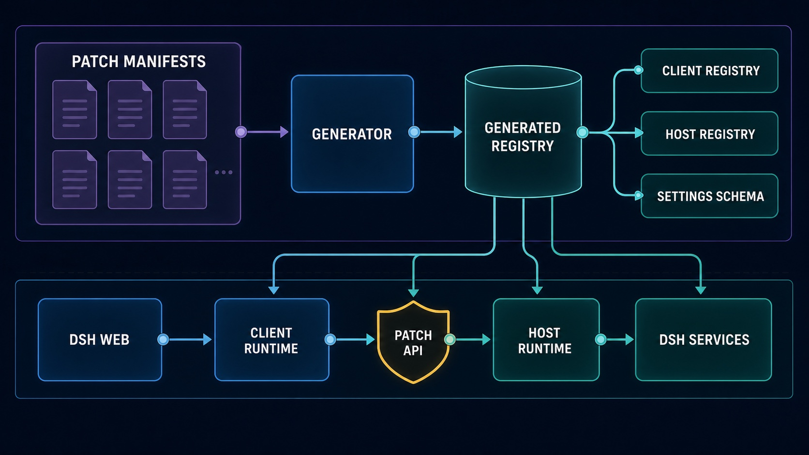
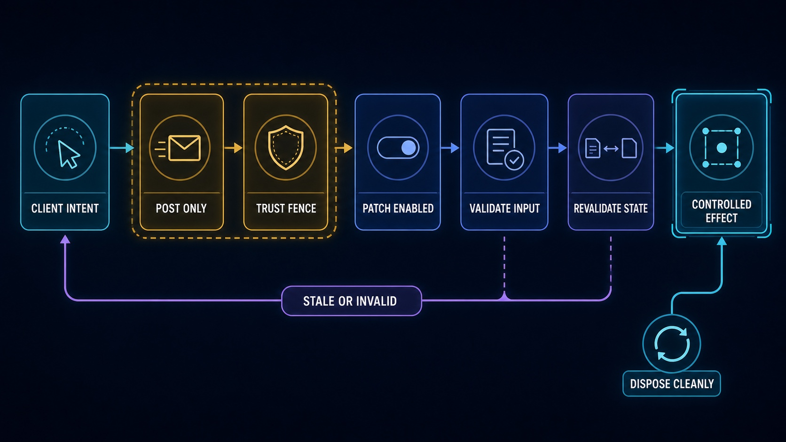

# DSH More

[English](./README.md) | [简体中文](./README.zh-CN.md)

Practical, independently switchable patches for missing context and history controls in DeepSeek Harness Web.

`dsh-more` integrates with the existing DSH interface instead of adding a separate management dashboard. Its current patch set can edit a user message and restart from that point, remove one message while preserving the surrounding context, and permanently delete a session while leaving native archive behavior intact.

> **Compatibility:** the current release targets DeepSeek Harness `0.1.0-rc.7` and requires Node.js `>= 24`. DSH is still a release candidate, so upgrades may require changes in the centralized adapter layer described below.

## Features

| Patch | Where it appears | Behavior | Default |
| --- | --- | --- | --- |
| Edit and restart | User-message action row | Creates a clean continuation before the selected turn, submits the edited text, archives the source branch, and opens the child session | On |
| Delete one message | User- and assistant-message action rows | Removes the selected model-surface node, expands only when tool call/result pairing requires it, rebuilds the surviving context, and opens a child session | On |
| Permanently delete session | Separate item beside the native Archive action | Stops and unloads the target session, removes its exact JSONL persistence directory, detaches it from workspaces, and synchronizes the lists incrementally | On |

All three switches live under **Settings → Plugins → Plugin configuration → DSH More** and take effect without rebuilding the plugin.

## Installation

### Requirements

- Node.js `>= 24`
- A working `dsh` CLI and a Web profile compatible with DSH `0.1.0-rc.7`
- Access to the npm registry that publishes `dsh-more`

pnpm is needed only when installing or developing from source. For a published release, use the DSH plugin command so the package is installed into the selected DSH profile; do not install it globally with `npm install -g`.

### Install the latest release from npm

```sh
dsh plugin --profile web add dsh-more
```

This resolves `dsh-more` from npm and adds it to the Web profile. Restart the running Web service after the command finishes:

```sh
dsh web
```

If `dsh web` is already running, stop that process first and start it again. Then open **Settings → Plugins → Plugin configuration** and confirm that **DSH More** appears.

You can also verify the installed dependency from the command line:

```sh
dsh plugin --profile web list dsh-more --depth 0
```

### Install a specific version

Pin the install when you need reproducible behavior or are testing a DSH compatibility combination:

```sh
dsh plugin --profile web add dsh-more@0.0.1
```

### Update to the latest release

```sh
dsh plugin --profile web add dsh-more@latest
```

Restart `dsh web` after updating. Existing patch settings remain in the DSH `dsh-more` Settings namespace.

### Newly published releases and `minimumReleaseAge`

A Web profile may intentionally reject a release that is newer than its pnpm `minimumReleaseAge`. The safest option is to wait for that cooling period. If you published or independently verified the release and intentionally want to install it immediately, relax the policy for this command only:

```sh
dsh plugin --profile web add --config.minimumReleaseAge=0 dsh-more@latest
```

This does not change the profile's long-term configuration, but it does relax the age check for the command's dependency resolution. Do not use it for an unverified package or rebuild the profile lockfile merely to bypass the policy.

### Install from a local checkout

Use this path for development before publishing to npm:

```sh
pnpm install
pnpm run check
dsh plugin --profile web add /absolute/path/to/dsh-more
```

If local linking is blocked only because another dependency already locked in the Web profile has not satisfied `minimumReleaseAge`, use the existing store and a one-command policy override:

```sh
dsh plugin --profile web add --offline --config.minimumReleaseAge=0 /absolute/path/to/dsh-more
```

`--offline` prevents new downloads, and both flags apply only to this command. Restart `dsh web` after installing the local checkout.

### Uninstall

```sh
dsh plugin --profile web remove dsh-more
```

Restart `dsh web` once more. Removing the package removes its UI and runtime patches; it does not rewrite or recover session data that was already changed or permanently deleted while the plugin was installed.

## Usage and data semantics

### Edit a user message and restart

1. Hover over a user message and choose **Edit and restart from here**.
2. Change the text and select **Preview changes**.
3. Review how many turns will be discarded.
4. Confirm the edit.

The plugin cuts the durable log immediately before the selected message's owning turn, creates a child session with the same workspace, live preset composition, provider/model selection, and token limit, then sends the edited message as the next user input. The source session is archived, not physically deleted.

The first turn in the child reuses runtime context already retained by the seed so DSH does not append a duplicate system-prompt snapshot. Normal live context assembly resumes after that turn.

### Delete one message in place

1. Hover over a user or assistant message and choose **Delete this message**.
2. Review the message and any additional context nodes required for tool pairing.
3. Confirm the deletion.

Deletion is implemented as context reconstruction, not as a tombstone placed in front of the model. The plugin selects the surviving current model surface, rebuilds ordinary balanced turns and steps in a child session, archives the source branch, and opens the child. The deleted content is absent from the child's raw history, trajectory, and future model input.

Only the selected node is removed unless a tool call/result range must remain atomic. Editing is the operation that intentionally discards the selected turn and everything after it.

Both continuation operations preallocate their destination during preview and watch DSH's incremental `session-added` event while committing. As soon as the child appears, the client hands off directly instead of refreshing the list, passing through a blank view, and then reopening. A full refresh remains only as a compatibility fallback when the incremental event is missing.

### Permanently delete a session

Open a session row's overflow menu and choose the separate **Permanently delete session** action. Native **Archive session** remains unchanged.

After confirmation, DSH More cancels a running task, waits for idle, flushes the session, unloads its Agent/Session handles, removes the exact persistence directory returned by DSH, and detaches the session from its workspaces. The UI follows DSH incremental events first and refreshes the lists only when those events are missing. Deleting the current session selects an adjacent visible session first so the conversation area does not pass through a blank state.

> **Irreversible:** permanent deletion does not archive the session and does not move it into a DSH More trash directory.

## Architecture



The diagram intentionally contains no patch names or patch count. Adding a patch should update the generated catalog and the Markdown feature table, not require a new architecture image.

The repository is divided into four responsibilities:

- **Patch manifests and implementations** — each `src/patches/<patch-id>/patch.json` is the single discovery entry for one self-contained Host/Client patch.
- **Generated registry** — `pnpm run generate` validates manifests and derives the typed catalog, default Settings schema, Host registry, and Client registry under ignored `src/generated/`.
- **Patch kernel** — `src/kernel/` owns activation, disposal, shared message-action composition, Settings projection, and patch contracts without containing DSH-specific feature logic.
- **DSH adapter** — `src/platform/dsh/` concentrates Web slots/DOM targeting, the patch API, trust checks, session access, confirmation tokens, runtime-context replay, and wire-format validation.

At runtime, the Client bundle contributes controls to native DSH slots and calls `/<plugin>/api/<patch>/<action>`. The Host bundle gates the request, dispatches it to the owning enabled patch, and lets the patch use only the DSH services injected by the plugin manifest.

### Why manifest-driven patches?

A normal feature patch can be added without editing either root entry point:

1. create `src/patches/<patch-id>/`;
2. declare its identity, order, default state, Host entry, and Client kind in `patch.json`;
3. export `hostPatch` plus either `useMessageActions` or `clientPatch`;
4. colocate its tests;
5. run the generator and build.

The generator rejects missing entries, invalid or mismatched IDs, duplicate ordering, and unsupported Client kinds. This keeps discovery, runtime activation, Settings, and build output aligned.

## Safety model



The generic protocol is stable even as patches are added:

- mutation routes accept `POST` with `application/json` only, cap bodies at 64 KiB, and require `x-dsh-more: 1`;
- the request authority must be loopback or an explicitly trusted host, cross-site requests are rejected, and a supplied `Origin` must match;
- disabled patches are rejected at the Host router even if an old Client still sends a request;
- all wire payloads start as `unknown` and are validated before use;
- message previews receive five-minute HMAC confirmation tokens bound to the session, log revision, surface generation, selected nodes, operation, target, preallocated continuation session, and edited-content digest;
- commits re-read current state, reject stale previews, and require an idle Agent maintenance window;
- failed continuation publication detaches the preallocated child and disposes its Agent handle before returning the error;
- unexpected Host failures are logged with diagnostics while the browser receives a generic internal-error response instead of local paths or stack details;
- Host setup and Client DOM effects are independently disposable when a patch is disabled;
- physical deletion accepts only an absolute per-session `jsonl` location with DSH's fixed transcript filename, unloads the live session, then deletes that exact session-owned directory; local paths are not returned to the Client.

## Design principles

- **Native surfaces first.** Controls extend DSH's message rows, menus, overlays, and plugin settings instead of duplicating the product UI.
- **Clean continuations over synthetic history.** Context editing creates valid ordinary turns and steps; it does not inject deletion notices, empty assistant replacements, or special model-visible markers.
- **Preserve live composition.** Child sessions inherit the source Agent's current preset composition and model configuration rather than resolving a potentially different preset generation.
- **Centralize fragile integration.** DSH APIs, internal compatibility access, DOM selectors, request boundaries, and runtime replay live in the adapter layer rather than leaking across patches.
- **Everything switches off cleanly.** Host listeners/wrappers and Client observers/DOM contributions have explicit cleanup paths.
- **Keep native semantics separate.** Permanent deletion is a separate action; it never silently changes what DSH's Archive action means.

## Project layout

```text
src/
├── patches/          # Feature manifests, Host/Client code, shared wire types, tests
├── kernel/           # Patch contracts, activation, Settings card, shared UI composition
├── platform/dsh/     # Centralized DSH Host/Client adapters and security boundary
└── generated/        # Generated locally; ignored and never edited by hand
scripts/              # Registry generation
test/                 # Cross-patch kernel/platform contract tests
build.mjs             # Host ESM, Client bundle, declarations, injection validation
```

## Development

Read [CONTRIBUTING.md](./CONTRIBUTING.md) before adding a patch. It documents the patch-directory boundary, Host/Client contracts, destructive-operation requirements, test placement, and review checklist. The current contribution guide is written in Simplified Chinese.

```sh
pnpm run generate       # Validate manifests and rebuild src/generated/
pnpm run peers:check    # Verify the locked peer-dependency graph
pnpm run typecheck      # Generate, then run strict TypeScript checks
pnpm test               # Generate, then run the Vitest suite
pnpm run build          # Generate declarations plus Host and Client bundles
pnpm run check          # Typecheck, test, and build
pnpm run package:check  # Inspect the npm package without writing a tarball
pnpm run package        # Build and create the npm tarball
```

Generated source, `dist/`, and tarballs are not committed. `prepack` runs the complete check before `npm pack` or `npm publish`.

### Verification scope

Automated tests cover patch registry alignment, independent activation/disposal, Settings projection, mutation trust checks, confirmation expiry/tampering/staleness, message selection and clean rebuilds, runtime-context continuity, and cold/live session deletion.

The repository does not currently contain a full browser end-to-end suite against a real DSH Web instance. After changing DSH versions or UI adapters, manually verify message control placement, patch toggles, Chinese/English native menu detection, busy-session rejection, child-session navigation, and cold/live permanent deletion.

## Compatibility notes

- The current dependency set targets DSH `0.1.0-rc.7`; pre-release API or DOM changes can require adapter updates.
- In-product DSH More copy is currently primarily Simplified Chinese, although native Copy/Archive selectors recognize both Chinese and English labels.
- Message actions operate only on ordinary user messages and assistant messages still present in the current model surface; editing requires a completed owning turn.
- Permanent deletion supports DSH persistence locations of kind `jsonl` only.
- Unloading a live session prefers tracked public Agent handles. An already-live untracked session uses a guarded compatibility path for the current DSH registry internals, so this path deserves special review on DSH upgrades.

## License

[MIT](./LICENSE)
