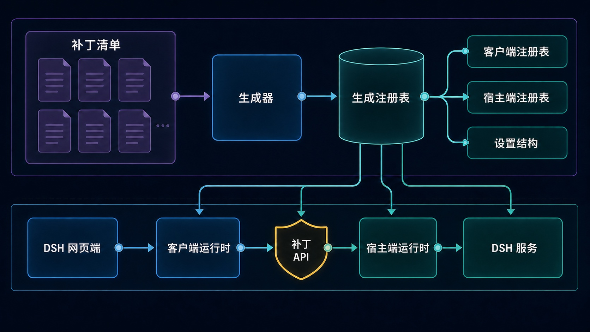
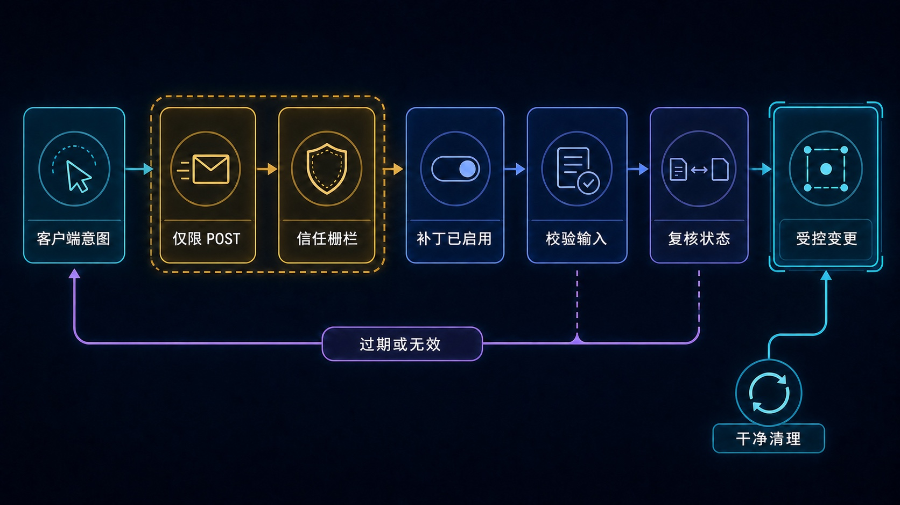

# DSH More

[English](./README.md) | [简体中文](./README.zh-CN.md)

为 DeepSeek Harness Web 补齐上下文与历史控制能力的一组实用补丁；每个补丁都可以独立启停。

`dsh-more` 不创建平行的“管理中心”，而是把能力直接嵌入 DSH 现有界面。当前补丁可以编辑用户消息并从该处重新开始、在保留前后上下文的前提下删除单条消息，以及在不改变原生归档语义的情况下永久删除会话。

> **兼容性：** 当前发布面向 DeepSeek Harness `0.1.0-rc.7`，要求 Node.js `>= 24`。DSH 仍是 RC 版本，升级后可能需要调整下文所述的集中适配层。

## 功能概览

| 补丁 | 出现位置 | 行为 | 默认状态 |
| --- | --- | --- | --- |
| 编辑并重新开始 | 用户消息操作区 | 在所选轮次之前创建干净延续，提交编辑后的文本，归档源分支并打开子会话 | 开启 |
| 单条消息删除 | 用户和助手消息操作区 | 删除所选 model-surface 节点；只有工具调用/结果配对需要时才扩大范围；重建存活上下文并打开子会话 | 开启 |
| 永久删除会话 | 原生“归档会话”旁的独立菜单项 | 停止并卸载目标会话，移除其精确 JSONL 持久化目录，从 Workspace 脱离并增量同步列表 | 开启 |

三个开关都位于 **设置 → 插件 → 插件配置 → DSH More**，修改后实时生效，无需重新构建插件。

## 安装

### 环境要求

- Node.js `>= 24`
- 可正常使用的 `dsh` CLI，以及与 DSH `0.1.0-rc.7` 兼容的 Web profile
- 能访问发布 `dsh-more` 的 npm registry

只有从源码安装或参与开发时才需要 pnpm。安装已发布版本时，应通过 DSH 插件命令把包加入指定 profile；不要使用 `npm install -g` 全局安装。

### 从 npm 安装最新版

```sh
dsh plugin --profile web add dsh-more
```

该命令会从 npm 解析 `dsh-more` 并加入 Web profile。完成后重新启动 Web 服务：

```sh
dsh web
```

如果 `dsh web` 已经在运行，先停止原进程，再重新启动。随后打开 **设置 → 插件 → 插件配置**，确认列表中出现 **DSH More**。

也可以通过命令行核对已经安装的依赖：

```sh
dsh plugin --profile web list dsh-more --depth 0
```

### 安装指定版本

需要可复现的行为，或正在验证一组 DSH 兼容版本时，可以固定版本安装：

```sh
dsh plugin --profile web add dsh-more@0.0.1
```

### 更新到最新版

```sh
dsh plugin --profile web add dsh-more@latest
```

更新后重启 `dsh web`。已有补丁开关仍保存在 DSH 的 `dsh-more` Settings namespace 中。

### 新发布版本与 `minimumReleaseAge`

Web profile 可能会按照 pnpm 的 `minimumReleaseAge` 主动拒绝发布时间过近的版本。最安全的做法是等待冷却期结束。如果这是你自己发布或已经独立核验过的版本，并且明确希望立刻安装，可以只为本次命令放宽策略：

```sh
dsh plugin --profile web add --config.minimumReleaseAge=0 dsh-more@latest
```

这不会修改 profile 的长期配置，但会为本次依赖解析放宽版本年龄检查。不要对未经核验的包使用，也不要仅仅为了绕过策略而重建 profile lockfile。

### 从本地源码安装

尚未发布，或者需要参与开发时使用这条路径：

```sh
pnpm install
pnpm run check
dsh plugin --profile web add /absolute/path/to/dsh-more
```

如果本地 link 只是因为 Web profile 中另一个已锁定依赖尚未满足 `minimumReleaseAge` 而被阻止，可以复用已有 store，并仅为这一次命令放宽策略：

```sh
dsh plugin --profile web add --offline --config.minimumReleaseAge=0 /absolute/path/to/dsh-more
```

`--offline` 会阻止下载新包，两个参数都只作用于本次命令。安装本地源码后同样需要重启 `dsh web`。

### 卸载

```sh
dsh plugin --profile web remove dsh-more
```

卸载后再次重启 `dsh web`。移除 npm 包会删除插件 UI 和运行时补丁，但不会重写或恢复插件安装期间已经发生的数据变更，也无法找回已经永久删除的会话。

## 使用方式与数据语义

### 编辑用户消息并从这里重新开始

1. 把鼠标移到用户消息上，选择 **编辑并从这里重新开始**。
2. 修改文本并点击 **修改并重新开始**，修改会直接生效，不再显示二次预览确认。

插件会在所选消息所属轮次之前切断持久日志，创建继承相同 Workspace、源 Agent 当前 Preset composition、provider/model 和 token limit 的子会话，再把编辑后的消息作为下一条用户输入。源会话只会归档，不会物理删除。

子会话第一轮复用 seed 已经保留的 runtime context，避免 DSH 重复追加 system-prompt snapshot；第一轮结束后恢复正常的实时上下文装配。

### 就地删除单条消息

1. 把鼠标移到用户或助手消息上，选择 **删除这条消息**。
2. 检查消息内容，以及为保持工具配对而必须额外影响的上下文节点。
3. 确认删除。

删除采用上下文重建，而不是向模型插入“已删除”墓碑。插件从当前 model surface 选择仍需保留的节点，在子会话中重建普通、平衡的 turn/step，归档源分支并打开子会话。被删除内容不会出现在子会话的原始 history、trajectory 或后续模型输入中。

除非工具调用与结果必须保持原子性，否则只删除用户点选的节点。会主动丢弃所选轮次及其后内容的是“编辑并重新开始”。

编辑会在单次提交内部完成状态检查并预分配延续会话；消息删除仍在确认前显示预览。两者都会在提交期间监听 DSH 的 `session-added` 增量事件；新会话一出现就直接完成交接，不再先刷新列表、短暂进入空白页再打开新会话。全量刷新只保留为增量事件缺失时的兼容兜底。

### 永久删除会话

打开会话行的“…”菜单，选择独立的 **永久删除会话**。原生 **归档会话** 的行为保持不变。

确认后，DSH More 会取消正在运行的任务、等待空闲、flush 会话、卸载 Agent/Session handle、删除 DSH 返回的精确持久化目录、从所属 Workspace 脱离，并优先通过 DSH 增量事件同步界面；只有事件缺失时才回退到列表刷新。删除当前会话时会先切换到相邻的可见会话，避免中间出现空白页。

> **不可恢复：** 永久删除不会归档会话，也不会把会话移入 DSH More 回收目录。

## 架构



图中刻意不出现任何补丁名称或补丁数量。新增补丁时只需更新生成目录和 Markdown 功能表，不应因为当前功能变化而重画架构图。

仓库分为四类职责：

- **补丁清单与实现**：每个 `src/patches/<patch-id>/patch.json` 是一个独立 Host/Client 补丁的唯一发现入口。
- **生成注册表**：`pnpm run generate` 校验清单，并在已忽略的 `src/generated/` 下派生类型化 catalog、默认 Settings schema、Host registry 和 Client registry。
- **补丁内核**：`src/kernel/` 负责启停、清理、共享消息操作组合、Settings 投影和补丁契约，不放具体 DSH 功能逻辑。
- **DSH 适配层**：`src/platform/dsh/` 集中处理 Web slot/DOM 定位、补丁 API、信任检查、Session 访问、确认令牌、runtime-context replay 和线协议校验。

运行时，Client bundle 向 DSH 原生 slot 注入控件，并调用 `/<plugin>/api/<patch>/<action>`；Host bundle 负责请求栅栏、已启用状态检查和路由分发，具体补丁只能使用插件清单明确注入的 DSH 服务。

### 为什么使用清单驱动补丁？

普通功能补丁不需要修改两个根入口：

1. 创建 `src/patches/<patch-id>/`；
2. 在 `patch.json` 声明 ID、顺序、默认状态、Host 入口和 Client 类型；
3. 导出 `hostPatch`，以及 `useMessageActions` 或 `clientPatch`；
4. 在同一目录放置测试；
5. 执行生成和构建。

生成器会拒绝缺失入口、非法或不一致的 ID、重复顺序以及不支持的 Client 类型，从源头保持发现、运行时启停、Settings 与构建产物一致。

## 安全模型



这套通用协议不会随补丁数量变化：

- 写接口只接受 `POST` 与 `application/json`，body 上限为 64 KiB，并要求 `x-dsh-more: 1`；
- 请求 authority 必须是 loopback 或显式 trusted host；拒绝 cross-site；存在 `Origin` 时必须与 Host 匹配；
- 即使旧 Client 继续发请求，Host router 也会拒绝已关闭补丁；
- 所有线协议 payload 都从不可信 `unknown` 开始，先校验再使用；
- 消息操作的状态检查会获得五分钟 HMAC 确认令牌，绑定 Session、日志 revision、surface generation、选中节点、操作类型、目标、预分配的延续会话与编辑内容摘要；编辑在一次点击内完成检查与提交，消息删除则保留用户可见的预览确认；
- 提交阶段重新读取当前状态，过期或失配的预览会被拒绝，并要求 Agent 处于 idle maintenance window；
- 续接发布失败时，会先从 Workspace 移除预分配子会话并释放其 Agent handle，再返回错误；
- 未预期的 Host 异常保留在服务端日志中，浏览器只收到通用内部错误，不暴露本机路径或堆栈细节；
- 关闭补丁时，Host setup 和 Client DOM 副作用都可以独立清理；
- 物理删除只接受绝对的逐会话 `jsonl` 定位与 DSH 固定 transcript 文件名，卸载实时会话后只删除该会话自有目录；本机路径不会返回 Client。

## 设计思想

- **优先延伸原生界面。** 使用 DSH 的消息行、菜单、overlay 和插件设置，不复制一套产品 UI。
- **用干净延续代替合成历史。** 上下文编辑重建合法普通 turn/step，不插入删除提示、空助手替换或模型可见的专属标记。
- **保留实时 composition。** 子会话继承源 Agent 当前 Preset composition 和模型配置，不按 ID 重新解析一个可能不同代际的 Preset。
- **集中脆弱集成。** DSH API、内部兼容访问、DOM selector、请求边界和 runtime replay 都留在 adapter，而不是扩散到每个补丁。
- **所有能力都能干净关闭。** Host listener/wrapper 与 Client observer/DOM contribution 都有明确 cleanup 路径。
- **原生语义保持独立。** 永久删除始终是独立操作，不会偷偷改写 DSH 原生“归档”的含义。

## 项目结构

```text
src/
├── patches/          # 功能清单、Host/Client 代码、共享线协议类型、测试
├── kernel/           # 补丁契约、启停、Settings 卡片、共享 UI 组合
├── platform/dsh/     # 集中的 DSH Host/Client 适配与安全边界
└── generated/        # 本地生成；已忽略，禁止手工编辑
scripts/              # 注册表生成
test/                 # 跨补丁 kernel/platform 契约测试
build.mjs             # Host ESM、Client bundle、声明和 inject 校验
```

## 开发

新增补丁前先阅读 [CONTRIBUTING.md](./CONTRIBUTING.md)。其中记录了补丁目录边界、Host/Client 契约、破坏性操作要求、测试位置和审阅清单。

```sh
pnpm run generate       # 校验清单并重建 src/generated/
pnpm run peers:check    # 校验锁定依赖的 peer 契约
pnpm run typecheck      # 生成后执行严格 TypeScript 检查
pnpm test               # 生成后执行 Vitest 测试
pnpm run build          # 生成声明、Host 与 Client bundle
pnpm run check          # typecheck、test、build
pnpm run package:check  # 不写 tarball，检查 npm 入包内容
pnpm run package        # 构建并生成 npm tarball
```

生成源码、`dist/` 和 tarball 都不提交。`npm pack` 或 `npm publish` 之前，`prepack` 会执行完整检查。

### 验证范围

自动化测试覆盖注册表一致性、独立启停与清理、Settings 投影、写请求信任栅栏、确认令牌过期/篡改/状态变化、消息选择与干净重建、runtime-context 连续性，以及冷/实时会话删除。

仓库目前没有针对真实 DSH Web 实例的完整浏览器端到端套件。升级 DSH 或修改 UI adapter 后，仍需手动确认消息按钮位置、补丁开关、中英文原生菜单识别、忙碌会话拒绝、子会话跳转，以及冷/实时会话永久删除。

## 兼容性说明

- 当前依赖面向 DSH `0.1.0-rc.7`；预发布 API 或 DOM 变化可能要求更新 adapter。
- DSH More 的产品内文案目前以简体中文为主；对 DSH 原生 Copy/Archive 元素的定位同时识别中英文标签。
- 消息操作只面向仍在当前 model surface 中的普通用户消息和助手消息；编辑要求所属轮次已经完成。
- 永久删除只支持 DSH 返回的 `jsonl` 持久化定位。
- 卸载实时会话时优先使用插件追踪到的公开 Agent handle。对于插件启用前已经加载、未被追踪的会话，当前版本会走受保护的 DSH registry 内部兼容路径，因此升级 DSH 时应重点复核。

## 许可证

[MIT](./LICENSE)
